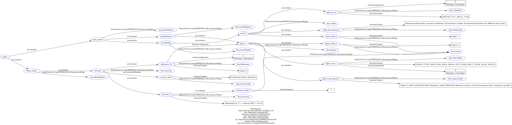
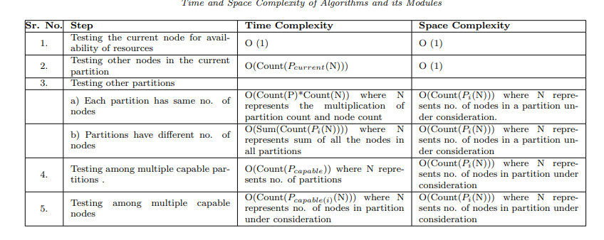
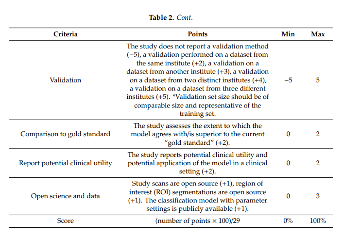

# table-and-figure-ie 

## Authors
Mateusz Jastrzębiowski, Aleksandra Muszkowska

Figures, Tables, Formulas extraction

Our tool extracts structured information from a scientific paper. We focused on extracting information such as figures, labels and formulas from the given PDF file with their references.  

## Solution

Our solution is divided into two parts. 
1. We extract data from the PDF file into XML/TEI format. This part is conducted by the [GROBID](https://github.com/kermitt2/grobid) library. GROBID is a machine learning library for extracting, parsing and re-structuring raw documents such as PDF into structured XML/TEI encoded documents with a particular focus on technical and scientific publications
2. We parse the XML file into a dictionary using \textit{xmltodict} Library into an RDF graph, and next, the Turtle format file with the final solution.

## Features

The project aims to prepare a Turtle file with extracted information about Tables, Figures and Formulas. The content the tool extracts are the following:

 1. **Figures**: We define the instances of the class `doco:Figure` from DoCo ontology, which contains the following information: 
   
      * figure box - is type `doco:FigureBox`. Contains property `c4o:hasContent` with a space within a document containing a figure and its caption and property `schema:pagination` with page number, which is the figure.
      * figure description - is type `doco:FigureLabel`. Contains property `c4o:hasContent` with a figure's caption.
      * figure label - is type `doco:Label`. Contains property `c4o:hasContent` with a figure's caption.
  
2. **Tables**: We define the instances of the class `doco:Table` from DoCo ontology, which contains the following information:
   * table box - is type `doco:TableBox`. Contains property `c4o:hasContent` with a space within a document that includes a table and its caption and property `schema:pagination` with page number, on which is the table. 
    * table description - is type `doco:TableLabel`. Contains property `c4o:hasContent` with a table's caption.
     * table label -  is type `doco:Label`. Contains property `c4o:hasContent` with a table's caption.

3. **Formulas**: We define the instances of the class `doco:Formula` from DoCo ontology, which contains the following information:

    * formula label - is type `doco:Label`. 
    * formula - string defined using property type `c4o:hasContent`.

4. **References**: References to the tables or figures type `deo:References`, containing properties:
   *  page on which references occur - provided using property `schema:pagination`.
   * reference to the table or figure - provided using property `dcterms:references`.
   * content of the referenced, using property `c4o:hasContent`.

5. **Section data**: To include information about references to Tables and Figures, we create an instance of the class `doco:Section` from the DOCO ontology, which contains the following information: 
   * section title - provided using property `po:containsAsHeader`, which points to an instance of type `doco:SectionTitle`. Instance `doco:SectionTitle` contains property `c4o:hasContent` with a section title. 
   * section page - provided using property `schema:pagination`.
   * figure, tables and formulas references - provided using the property `po:contains`, which points to table, figures references, or formulas instance appearing in a given section.


The ontology is mainly based on [DOCO](http://www.sparontologies.net/ontologies/doco) ontology, which presents examples of using the ontology, which inspired us. 

## Running

To run our solution, you will need a Docker on your computer. For installation tips, visit [Docker installation guide](https://docs.docker.com/desktop/install/windows-install/).

When you have Docker working on your computer, you need to create a container using our Docker image. To do this, run the `setup.bat` file (it is essential to have the setup.bat, Dockerfile, and fig_tab_ie.py files in the same directory). 

This simple batch script pulls the lfoppiano/grobid:0.7.2 image (GrobId image) and then uses the created by us Dockerfile to build a new image. By default, the script only builds the image, but if you want, you can uncomment the last line of the script to create a working container.

If you want to create a docker container separately, open CMD and just run the following command: `docker run -t --rm -p 8070:8070 fig_tab_ie:latest`.

To copy pdf files to docker container use: `docker cp <file_path> containerID:/home/input/<file_name>`.

To process pdfs, open the container's terminal and run the following command: `python3 /home/fig_tab_ie.py /home/input /home/output`.

`/home/input` is the default directory containing pdf files to process. `/home/output` is the default directory in which .ttl files will be placed.

### Output file name
The output file name is created as follows: `<paper title>_figures_and_tables.ttl` where `<paper title>` is extracted using the GROBID library, and all spaces are replaced with underscores. 

## Examples

In the below figure, we present a visualisation of information which can be generated using our tool.  



### Ontology description 
 
An instance, `:paper` always is the graph's root. It contains instances `:body_matter` and `:back_matter` of classes `doco:BodyMatter` and `doco:BackMatter` respectively. The `:body_matter` instance has a property `po:contains` which points to all the sections, and the `:back_matter` instance also has property `po:contains` which points to `:ListOfFigures` and `:ListOfTables` instances of classes `doco:ListOfFigures` and `doco:ListOfTables`. These instances contain the property `po:contains` pointing to figures and tables.

#### Figures 
Each figure is represented by the instance of the class `doco:Figure`, which has the property `po:contains` pointing to the following instances:
* `:figure_box_{nr}` of class `doco:FigureBox`. The instance has the following properties:   

    * `c4o:hasContent` - raw text with a list of lists with coordinates of the figures.
    * `schema:pagination` - integer with the page number on which 
    
* `:figure_description_{nr}` of class `doco:FigureLabel`. The instance has the property:    
    
    * `c4o:hasContent` - raw text with a caption of the figure.
    
* `:figure_label_{nr}` of class `doco:Label`The instance has the property:    

    * `c4o:hasContent` - raw text with a label of the figure.
    
#### Tables 
Similar each table is represented by the instance of the class `doco:Table` which has the property `po:contains` pointing to the following instances:

* `:table_box_{nr}` of class `doco:TableBox`. The instance has the following properties:
    

    * `c4o:hasContent` - raw text with a list with the table coordinates.
    * `schema:pagination` - integer with the page number on which the table is located.
    
* `:table_description_{nr}` of class `doco:TableLabel`. The instance has the property:    
    * `c4o:hasContent` - raw text with a caption of the table.
    
* `:table_label_{nr}` of class `doco:Label`The instance has the property:    
    * `c4o:hasContent` - raw text with a label of the table.

#### Formulas 
Each formula is represented by the instance of the class `doco:Formula` which has property \newline `c4o:hasContent` with the string with the formula and the property `po:contains` pointing to the following instance:

* `:formula_label_{nr}` of class `doco:Label`. The instance has the property:    
    * `c4o:hasContent` - raw text with the formula label.

#### References
Instances represent references of the tables and figures from class `deo:Reference` with properties:

* `dcterms:references` - points to the table or figure instance.
* `c4o:hasContent` - contains the content of the reference in the text.
* `schema:pagination` - integer with the page number on which the reference is located.

#### Sections
Each section is represented by the instance of the class `doco:Section` which has the property:
* `po:containsAsHeader` which points to an instance of type `doco:sectionTitle`, which has the property    
    * `c4o:hasContent` - raw text with the section’s title.
* `po:contains` - with the list of references to the tables and figures, in addition points to the formulas instances contained in a given section.
* `schema:pagination` -  integer with the page number on which the reference is located.


The example of generated Turtle file is below. We tested the [Attention Is All You Need](https://proceedings.neurips.cc/paper/2017/file/3f5ee243547dee91fbd053c1c4a845aa-Paper.pdf) paper. 

Remark: here, we present only parts of the generated file.

In the beginning, we define all needed prefixes.
```
@prefix : <http://mini.pw.edu.pl/table_and_figure_ie/> .
@prefix c4o: <http://purl.org/spar/c4o> .
@prefix dcterms: <http://purl.org/dc/terms/> .
@prefix deo: <http://purl.org/spar/deo/> .
@prefix doco: <http://purl.org/spar/doco> .
@prefix po: <http://www.essepuntato.it/2008/12/pattern#> .
@prefix schema: <http://schema.org/> .
@prefix xsd: <http://www.w3.org/2001/XMLSchema#> .

```

A the beginning, the instances of the list of figures and tables are created:
```
:paper po:contains :back-matter,
        :body-matter .

:ListOfFigures a doco:ListOfFigures ;
    po:contains :table_0,
        :table_1,
        :table_2 .

:ListOfTables a doco:ListOfTables ;
    po:contains :figure_0,
        :figure_1 .

:back-matter a doco:BackMatter ;
    po:contains :ListOfFigures,
        :ListOfTables .
```
Then we create an instance of the `doco:BodyMatter` class with sections.

```
:body-matter a doco:BodyMatter ;
    po:contains :section0,
        :section1,
        :section10,
        :section11,
...
```
The order of sections is not included because the second extraction team has proper ordering. In this work, sections are defined only to create proper references. Note that the numbering of the sections can be different with another team. The connection should be made based on the title of the sections. 

Next, let us look at the instance `:figure_0`:

```
:figure_0 a doco:Figure ;
    po:contains :figure_box_0,
        :figure_description_0,
        :figure_label_0 .
```
As we described, it contains the property `po:contains` pointing into instances `:figure_box_0`, `:figure_description_0`, `:figure_label_0`.

`:figure_box_0` contains information about the coordinates of the figure and page.
```
:figure_box_0 a doco:FigureBox ;
    c4o:hasContent "[[210.01, 405.82, 191.98, 8.64], [196.56, 72.0, 218.88, 322.42]]" ;
    schema:pagination 3 .
```
 `:figure_description_0` contains the caption of the figure.
```
:figure_description_0 a doco:FigureLabel ;
    c4o:hasContent "Figure 1: The Transformer -model architecture." .
```
`:figure_label_0` has label information.
```
:figure_label_0 a doco:Label ;
    c4o:hasContent "Figure 1 :" .
```

In a similar way content of Tables is presented.

```
:table_0 a doco:Table ;
    po:contains :table_box_0,
        :table_description_0,
        :table_label_0 .

:table_box_0 a doco:TableBox ;
    c4o:hasContent "[[107.69, 72.27, 396.31, 77.5]]" ;
    schema:pagination 6 .

:table_description_0 a doco:TableLabel ;
    c4o:hasContent "Maximum path lengths, per-layer complexity and a minimum number of sequential operations for …".

:table_label_0 a doco:Label ;
    c4o:hasContent "Table 1 :" .
```

The content of the formulas is presented in the following way:
```
:formula_2 a doco:Formula ;
    c4o:hasContent "lrate = d −0.5 model • min(step_num −0.5 , step_num • warmup_steps −1.5 )" ;
    po:contains :formula_label_2 .

:formula_label_2 a doco:Label ;
    c4o:hasContent "3" .
```

Sections contain only simple information about references, pages and title.

```
:section5 a doco:Section ;
    po:contains :formula_0,
        :reference_32 ;
    po:containsAsHeader :section_title5 .

:section_title5 a doco:SectionTitle ;
    c4o:hasContent "Scaled Dot-Product Attention" .
```

As we can see `:section5` has property `po:contains` with `:formula_0` and `:reference_32` concerning the `:figure_1`.

```
:reference_32 a deo:Reference ;
    dcterms:references :figure_1 ;
    c4o:hasContent "Figure 2" ;
    schema:pagination 3 .
```


## Issues

All known issues are caused by the GROBID parser, which parses PDF to XML files. Examples:

1. Inconsistent parsing of headers. The first two examples are from the same article, and the last one is from the other.
   
```
<head>Fig. 4 .</head>
```
```
<head>2</head>
```
```
<head>Table 1: :</head>
```

2. Identifying figure as a table. Typically when a figure is created using LateX tools. Example of an image from [U-Net: Convolutional Networks for Biomedical Image Segmentation](https://arxiv.org/pdf/1505.04597.pdf) paper, when GROBID detected table instead o figure.


3. Incorrect parsing of the section number, the section title itself, incorrect parsing of the section, parsing table, figures or other irrelevant text as section names.

```
<div xmlns="http://www.tei-c.org/ns/1.0">
<head>Contribution</head>
...
Section 5 concludes this paper and identifies paths for future work.</p>
<p>2. Related Work. Many researchers have addressed the load balancing challenges in their work
...
```


4. Tables are generally hard to detect, especially when the tables are presented in a more complex manner. Example of not detected table from article: *STATIC LOAD BALANCING TECHNIQUE FOR GEOGRAPHICALLY PARTITIONED PUBLIC CLOUD*.
   


   
5. Tables spanned on two pages, are hard to detect. In this example, a continuation of the table was detected as text and section names.

```
<head>Criteria</head>
<head>Points Min Max</head>
<head>Validation</head>
<p>The study does not report a validation method (−5), ...</p>

```




